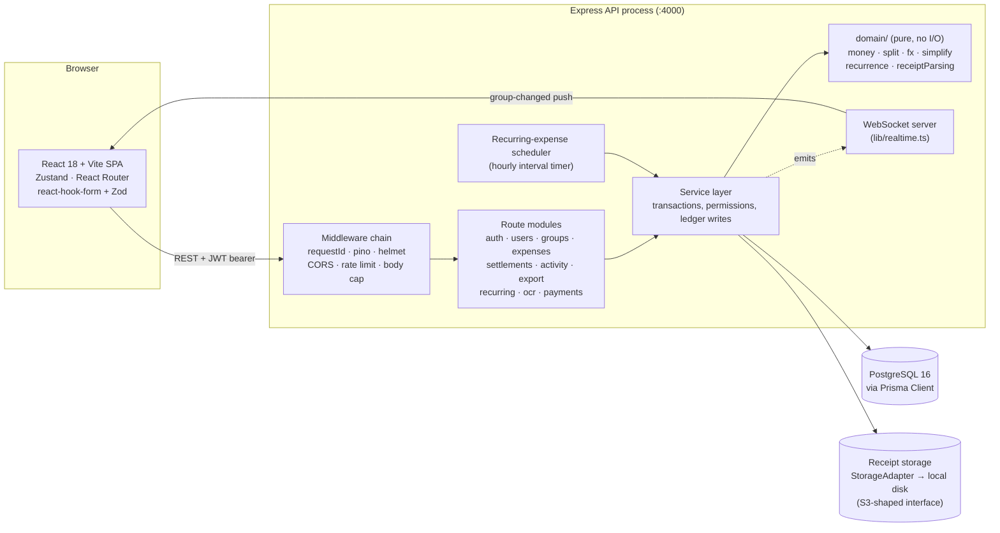
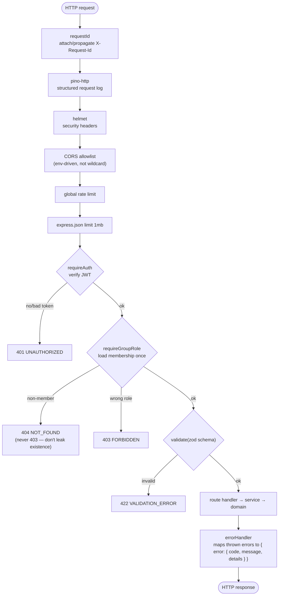
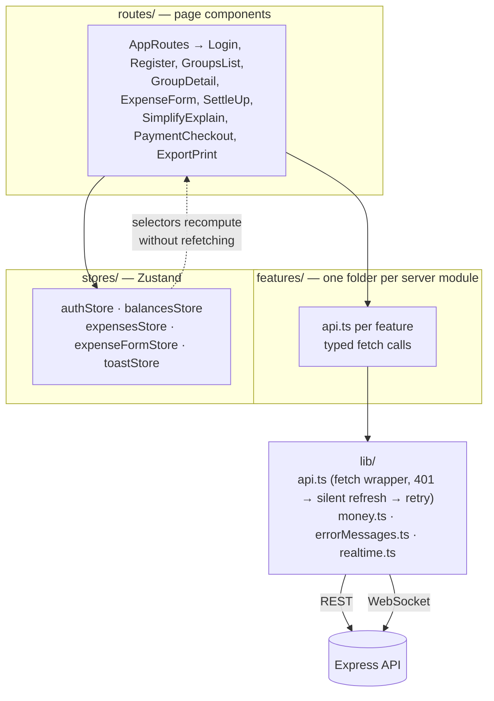
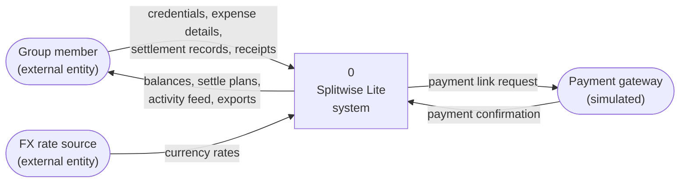
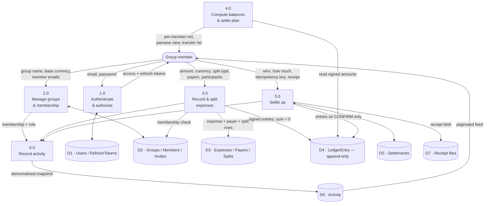
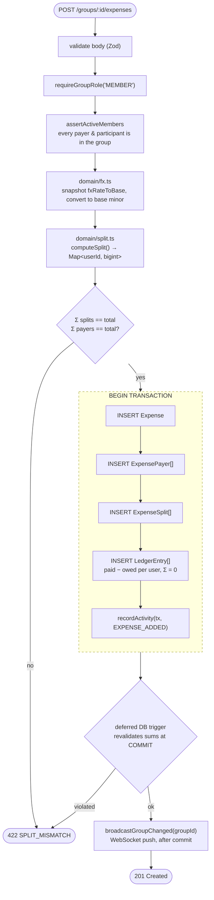
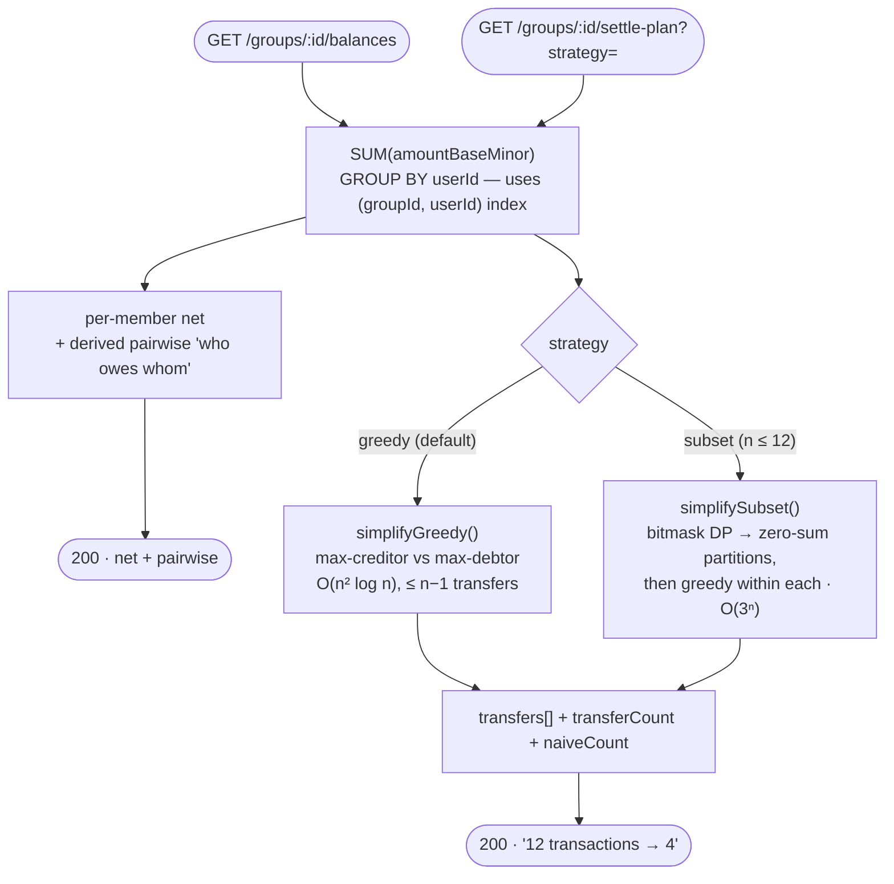
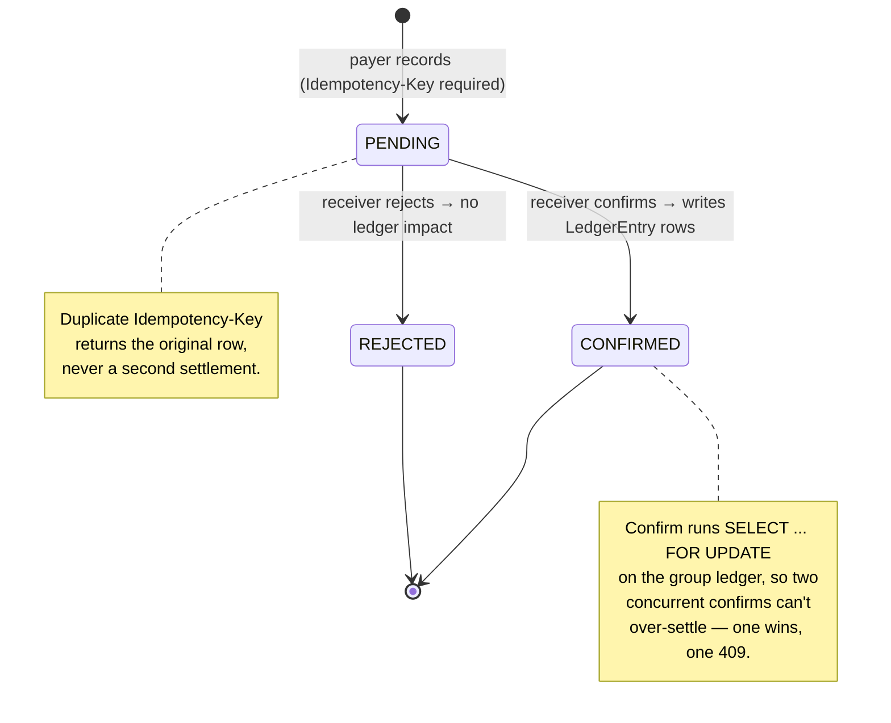

# Splitwise Lite

A group expense tracker with a correctness-first money ledger, multi-currency support, and a
debt-simplification engine that reduces settlements to the minimum practical number of cash
transfers.

**Backend:** Node.js 20 / TypeScript, Express 5, Prisma + PostgreSQL 16, JWT auth, Vitest + Supertest.
**Frontend:** React 18 + Vite, Zustand, React Router v6, react-hook-form + Zod, Tailwind CSS.

New to the codebase? Read [docs/PROJECT-GUIDE.md](docs/PROJECT-GUIDE.md) — it covers the tech stack
you need to know, a guided reading order through the source, and deployment. See
[project.md](project.md) for the phase-by-phase plan this was built against, and
[docs/api.md](docs/api.md) / [docs/decisions.md](docs/decisions.md) for the API contract and ADRs.

---

## Table of contents

- [Quick start](#quick-start)
- [System architecture](#system-architecture)
- [ER diagram (data model)](#er-diagram-data-model)
- [Data flow diagrams](#data-flow-diagrams)
- [The debt-simplification algorithm](#the-debt-simplification-algorithm)
- [Money and multi-currency](#money-and-multi-currency)
- [Permissions model](#permissions-model)
- [Repository layout](#repository-layout)
- [Testing](#testing)

---

## Quick start

### With Docker

```bash
docker compose up --build
```

This starts Postgres, runs pending migrations, and serves the API at `http://localhost:4000` and
the web app at `http://localhost:5173`. Adminer (a DB browser) is at `http://localhost:8080`.

Seed demo data (5 users, 2 groups, ~40 expenses across USD/EUR/INR, a couple of settlements):

```bash
docker compose run --rm server npm run seed
```

Seeding is a separate, explicit step rather than automatic on every `up`, so restarting the stack
never silently duplicates demo data. Log in as any seeded user — see
[server/prisma/seed.ts](server/prisma/seed.ts) for the emails (password `password123` for all).

### Locally, without Docker

Requires Node.js 20+ and a local PostgreSQL 16.

```bash
npm install                              # installs both workspaces

cp server/.env.example server/.env       # then edit DATABASE_URL etc. if needed
cp web/.env.example web/.env

npm run --workspace=server prisma:migrate
npm run --workspace=server seed          # optional, but nicer than an empty app

npm run dev                              # runs server (:4000) and web (:5173) together
```

Run the full check (lint + typecheck both workspaces + backend test suite):

```bash
npm run check
```

---

## System architecture

### Component view

Three processes and two persistence targets. The browser never talks to Postgres; the API is the
only writer.



### Layering rules

The backend is strictly layered, and the layering is the main thing to understand about this
codebase:

| Layer | Path | Knows about | Never does |
|---|---|---|---|
| Routes | `modules/*/routes.ts` | HTTP, Zod schemas, status codes | Money arithmetic, direct SQL |
| Services | `modules/*/service.ts` | Prisma, transactions, permissions | Parsing decimal strings, HTTP |
| Domain | `domain/*.ts` | Pure functions over `bigint` | I/O, Prisma, Express, `Date.now()` in math |

`domain/` is pure — no I/O, no Prisma — and is the **only** place decimal strings are parsed into
`BIGINT` minor units or formatted back. Everything above it passes `bigint` around and never does
its own arithmetic on money. It is also the only part of the codebase held to a 100%-branch-coverage
bar; the rest of the backend is held to ≥80% overall.

### Request lifecycle

Every request passes the same chain before reaching a handler:



`requireGroupRole` loads the caller's membership **once** and attaches it to `req.membership`, so
handlers never re-query it. A non-member gets `404`, not `403` — returning `403` would confirm the
group exists.

### Frontend architecture



`features/` mirrors the server's `modules/` one-to-one, so a change to an endpoint has an obvious
frontend counterpart. Derived state (e.g. simplified vs. direct debt view) lives in Zustand
selectors, so toggling views is instant with no network round-trip.

---

## ER diagram (data model)

Twelve tables. `User`, `Group` and `Expense` are the hubs; `LedgerEntry` is the source of truth for
all balances.

```mermaid
erDiagram
    User ||--o{ RefreshToken : "has sessions"
    User ||--o{ GroupMember : "joins"
    Group ||--o{ GroupMember : "has"
    Group ||--o{ GroupInvite : "issues"
    User ||--o{ GroupInvite : "creates / redeems"
    Group ||--o{ Expense : "contains"
    User ||--o{ Expense : "creates"
    Expense ||--|{ ExpensePayer : "paid by"
    Expense ||--|{ ExpenseSplit : "owed by"
    User ||--o{ ExpensePayer : "pays"
    User ||--o{ ExpenseSplit : "owes"
    Group ||--o{ LedgerEntry : "ledger of"
    User ||--o{ LedgerEntry : "affects"
    Group ||--o{ Settlement : "records"
    User ||--o{ Settlement : "from / to"
    Group ||--o{ Activity : "feed of"
    User ||--o{ Activity : "acts in"
    Group ||--o{ RecurringExpense : "schedules"

    User {
        uuid   id PK
        citext email UK
        string name
        string passwordHash
        string avatarUrl "nullable"
    }
    RefreshToken {
        uuid     id PK
        uuid     userId FK
        string   tokenHash UK "hashed at rest"
        datetime expiresAt
        datetime revokedAt "nullable; rotated on use"
    }
    Group {
        uuid     id PK
        string   name
        char3    baseCurrency
        uuid     createdById FK
        datetime archivedAt "nullable"
    }
    GroupMember {
        uuid      groupId PK "FK → Group"
        uuid      userId  PK "FK → User"
        GroupRole role "OWNER | MEMBER"
        datetime  leftAt "nullable"
    }
    GroupInvite {
        uuid     id PK
        uuid     groupId FK
        string   code UK
        datetime expiresAt
        uuid     usedById FK "nullable"
    }
    Expense {
        uuid      id PK
        uuid      groupId FK
        string    description
        string    category "nullable"
        char3     currency
        bigint    amountMinor "minor units"
        decimal   fxRateToBase "18,8 — snapshotted"
        bigint    amountBaseMinor
        SplitType splitType "EQUAL|EXACT|PERCENT|SHARES"
        int       version "optimistic lock"
        datetime  deletedAt "nullable; soft delete"
    }
    ExpensePayer {
        uuid   expenseId PK "FK → Expense"
        uuid   userId    PK "FK → User"
        bigint amountMinor
        bigint amountBaseMinor
    }
    ExpenseSplit {
        uuid    expenseId PK "FK → Expense"
        uuid    userId    PK "FK → User"
        decimal shareInput "raw % or weight, for re-editing"
        bigint  amountMinor
        bigint  amountBaseMinor
    }
    LedgerEntry {
        uuid             id PK
        uuid             groupId FK
        uuid             userId FK
        uuid             counterpartyId FK "nullable; set for settlements"
        bigint           amountBaseMinor "signed"
        LedgerSourceType sourceType "EXPENSE|EXPENSE_REVERSAL|SETTLEMENT|SETTLEMENT_REVERSAL"
        uuid             sourceId
    }
    Settlement {
        uuid             id PK
        uuid             groupId FK
        uuid             fromUserId FK
        uuid             toUserId FK
        char3            currency
        bigint           amountMinor
        bigint           amountBaseMinor
        string           receiptUrl "nullable"
        SettlementMethod method "CASH | GATEWAY"
        SettlementStatus status "PENDING|CONFIRMED|REJECTED"
        string           idempotencyKey UK
    }
    Activity {
        uuid     id PK
        uuid     groupId FK
        uuid     actorId FK
        string   type
        string   entityType
        uuid     entityId
        json     payload "denormalised snapshot"
        datetime createdAt
    }
    RecurringExpense {
        uuid               id PK
        uuid               groupId FK
        bigint             amountMinor
        json               splitsPayload
        json               payersPayload
        RecurrenceInterval interval "WEEKLY|MONTHLY|YEARLY"
        datetime           nextRunAt
        boolean            active
    }
```



### Why a ledger table instead of computed-on-the-fly sums

`LedgerEntry` is **append-only**. Editing an expense never mutates old rows — it writes reversal
entries against the current state and then fresh ones. This buys three things:

1. **Auditability** — every balance change traces back to a real row with a `sourceType`/`sourceId`.
2. **One uniform balance path** — expenses and settlements both resolve to ledger entries, so the
   balance query is a single `SUM` regardless of what caused the change.
3. **A feed that can't lie** — `Activity` rows point at real ledger/entity ids.

### Enforced invariants

| Invariant | Enforced by |
|---|---|
| `SUM(LedgerEntry.amountBaseMinor) = 0` for any `sourceId` | Service-layer transaction + tests |
| `SUM(ExpenseSplit.amountMinor) = Expense.amountMinor` | **DB trigger** (deferred to COMMIT) + code |
| `SUM(ExpensePayer.amountMinor) = Expense.amountMinor` | **DB trigger** (deferred to COMMIT) + code |
| A user's group balance = `SUM(LedgerEntry)` by group + user | `balances/service.ts` |
| One settlement per `Idempotency-Key` | `UNIQUE` constraint on `Settlement.idempotencyKey` |
| A member with non-zero balance can't be removed | `groups/service.ts` balance check |

The split/payer sums are enforced by a real deferred DB constraint, not just application code — a
request that violates it is a `422 SPLIT_MISMATCH`, and a bug that bypasses the service layer still
can't commit bad data.

### Key indexes

| Table | Index | Serves |
|---|---|---|
| `Expense` | `(groupId, createdAt)` | Cursor-paginated expense list |
| `Activity` | `(groupId, createdAt)` | Cursor-paginated activity feed |
| `LedgerEntry` | `(groupId, userId)` | Balance aggregation |
| `LedgerEntry` | `(sourceId)` | Reversal lookups on edit/delete |
| `RecurringExpense` | `(active, nextRunAt)` | Scheduler's due-row scan |

`EXPLAIN ANALYZE` output for the balances query is recorded in
[docs/decisions.md](docs/decisions.md).

---

## Data flow diagrams

### Level 0 — context diagram



### Level 1 — major processes and data stores



Note the asymmetry that defines the system: **`D4` (the ledger) is written by 3.0 and 5.0 but read
only by 4.0.** Balances are never stored — they are always derived by summing the ledger.

### Level 2 — the add-expense write path

Everything inside the dashed box is one Postgres transaction. Either all of it lands or none of it
does, so the ledger can never be half-written.



`recordActivity` is called **inside** the transaction, so an expense can never exist without its
feed entry. `broadcastGroupChanged` is called **after** commit, so clients are never told about a
change that then rolls back.

### Level 2 — the balances and settle-plan read path



The pairwise view is **derived on read**, never stored — there is no table of who-owes-whom.

### Settlement lifecycle

A settlement is a two-step handshake. The critical rule: **`PENDING` does not move the ledger.**



Only the **receiver** can confirm or reject. A config flag (`AUTO_CONFIRM_SETTLEMENTS`) collapses
this to one step for single-user demos.

---

## The debt-simplification algorithm

A group's raw activity produces a web of pairwise debts. Settling every pair one-by-one (the
"naive" count reported alongside `GET /groups/:id/settle-plan` as `naiveCount`) is correct but
wasteful — most of those debts net out. The actual minimum number of transfers to zero out a set
of balances is NP-hard in general (it reduces to set partition), so both strategies here are
practical approximations:

- **`greedy`** ([`domain/simplify.ts`](server/src/domain/simplify.ts), default): repeatedly match
  the largest current creditor against the largest current debtor, transfer
  `min(|creditor|, |debtor|)`, and repeat. This is the classic heap-based bipartite-matching
  heuristic, implemented here with a plain re-sorted array each iteration instead of a real heap
  (deliberate, for a group size where the constant factor difference doesn't matter) —
  **O(n² log n)** for n balances. Each iteration zeroes at least one participant, so it always
  produces at most **n − 1** transfers.
- **`subset`** (`simplifySubset`): for groups small enough to be worth it (n ≤ 12), first searches
  for a partition of the balances into independent zero-sum subsets via bitmask DP over all
  `2ⁿ` subsets (**O(3ⁿ)** total, from the standard "sum over subsets of subsets" partition-search
  recurrence), then runs `greedy` independently *within* each subset. Settling within smaller
  independent groups instead of across the whole set can only produce the same number of
  transfers or fewer than plain greedy on the same input — never more — because any transfer
  greedy would produce across two independent subsets is one that correctly stays contained
  within a subset instead. Above n = 12, `simplifySubset` just delegates to `greedy` — the O(3ⁿ)
  search stops being worth it long before then.

Both strategies are property-tested ([`server/tests/simplify.test.ts`](server/tests/simplify.test.ts))
against randomly generated zero-sum balance sets: applying the returned transfers always zeroes
every balance exactly, and `subset` never returns more transfers than `greedy` on the same input.

`GET /groups/:id/settle-plan` returns the transfer list, the transfer count, and the naive count
side by side, so the UI can show the headline result — *"12 transactions → 4"*. There is also an
animated step-by-step **explain view** (`SimplifyExplainPage`) that replays the greedy matching.

---

## Money and multi-currency

All amounts are stored and computed as `BIGINT` minor units (paise/cents) — **never floats** — and
decimal strings are the only representation that crosses the API boundary (`"20.00"`, not `20.0`).
`domain/money.ts` owns currency metadata, including the fact that JPY has 0 decimal places rather
than 2.

Expenses in a currency other than the group's `baseCurrency` are converted **once, at creation
time**, using a snapshotted exchange rate (`fxRateToBase`) computed via pure `BIGINT` fixed-point
arithmetic ([`domain/fx.ts`](server/src/domain/fx.ts)) — no floating point, no `decimal.js`
dependency. Rates are never re-fetched for an existing expense, so historical balances don't drift
when rates move, exactly like a real ledger. Rate lookup sits behind a `RateProvider` interface
with a daily cache and a fallback to the last-known rate.

Balances and simplification always run in base currency; the UI shows both the original and base
amounts (`₹4,150 (€45.00)`).

---

## Permissions model

Enforced server-side on every route via `requireGroupRole`, never merely hidden in the UI.

| Action | Non-member | Member | Expense creator | Group owner |
|---|---|---|---|---|
| View group, expenses, balances | ✗ | ✓ | ✓ | ✓ |
| Add expense | ✗ | ✓ | ✓ | ✓ |
| Edit / delete expense | ✗ | ✗ | ✓ | ✓ |
| Record settlement (as payer) | ✗ | ✓ | ✓ | ✓ |
| Confirm settlement | ✗ | receiver only | receiver only | receiver only |
| Invite / remove member | ✗ | ✗ | ✗ | ✓ |
| Rename / archive group | ✗ | ✗ | ✗ | ✓ |

A member with a non-zero balance **cannot** be removed from a group.

---

## Repository layout

```
splitwise-lite/
├─ docker-compose.yml          # postgres, adminer, server, web
├─ docs/
│  ├─ api.md                   # full API contract
│  ├─ decisions.md             # ADRs: rounding, fx, simplification, indexes, N+1 audit
│  └─ PROJECT-GUIDE.md         # how to learn this codebase + deployment
├─ server/
│  ├─ prisma/
│  │  ├─ schema.prisma         # 12 models
│  │  ├─ migrations/           # 6 migrations
│  │  └─ seed.ts               # 5 users, 2 groups, ~40 expenses, 3 currencies
│  ├─ src/
│  │  ├─ index.ts              # boot: HTTP + WebSocket + scheduler
│  │  ├─ app.ts                # middleware chain + route mounting
│  │  ├─ config/               # Zod-validated env, pino logger
│  │  ├─ db/client.ts          # Prisma singleton
│  │  ├─ middleware/           # requestId, cors, rate limit, auth, role, validate, errors
│  │  ├─ modules/              # one folder per domain: routes.ts / schemas.ts / service.ts
│  │  ├─ domain/               # PURE money/split/fx/simplify — 100% branch coverage
│  │  ├─ lib/                  # activity, csv, id, imageType, params, realtime, storage
│  │  └─ types/
│  └─ tests/                   # 20 files, 126 tests
└─ web/
   ├─ src/
   │  ├─ routes/               # page components
   │  ├─ components/           # AppLayout, ErrorBoundary, ProtectedRoute, Skeleton, Toasts
   │  ├─ features/             # mirrors server modules, one api.ts each
   │  ├─ stores/               # Zustand: auth, balances, expenses, expenseForm, toast
   │  └─ lib/                  # api.ts (fetch + silent refresh), money.ts, realtime.ts
   └─ index.html
```

---

## Testing

```bash
npm run test --workspace=server                  # full backend suite
npx vitest run --coverage --workspace=server     # with coverage report
```

**Current status: 126 tests across 20 files, all passing.** Coverage is 100% of branches on
`domain/` and 91% overall on the backend.

> **Note:** the suite truncates every table in `beforeEach`. Point `TEST_DATABASE_URL` at a separate
> database (e.g. `splitwise_test`) so running tests doesn't wipe your dev/seed data.

The full-lifecycle integration test ([`server/tests/lifecycle.test.ts`](server/tests/lifecycle.test.ts))
exercises the end-to-end scenario: create a group, add expenses with mixed split types, fetch
balances, fetch a settle-plan, confirm every suggested transfer, and assert every balance is back
to exactly zero.
