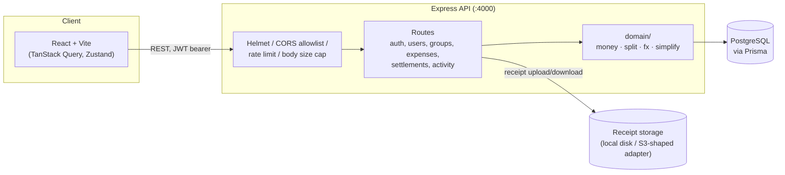

# Splitwise Lite

A group expense tracker with a correctness-first money ledger, multi-currency support, and a
debt-simplification engine that reduces settlements to the minimum practical number of cash
transfers.

Backend: Node.js/TypeScript, Express 5, Prisma + PostgreSQL, JWT auth, Vitest/Supertest.
Frontend: React 18 + Vite, Zustand, TanStack Query, Tailwind. See [project.md](project.md) for
the full phase-by-phase build plan this app was built against, and [docs/api.md](docs/api.md) /
[docs/decisions.md](docs/decisions.md) for the API contract and design write-ups.

## Quick start (Docker)

```bash
docker compose up --build
```

This starts Postgres, runs pending migrations, and serves the API at `http://localhost:4000` and
the web app at `http://localhost:5173`. Seed demo data (5 users, 2 groups, ~40 expenses across
USD/EUR/INR, a couple of settlements) with:

```bash
docker compose run --rm server npm run seed
```

Seeding is a separate, explicit step rather than automatic on every `up`, so restarting the stack
never silently duplicates demo data. Login as any seeded user — see `server/prisma/seed.ts` for
the emails (password `password123` for all of them).

## Quick start (local, no Docker)

Requires Node.js 20+ and a local PostgreSQL 16.

```bash
npm install                              # installs both workspaces

cp server/.env.example server/.env       # then edit DATABASE_URL etc. if needed
cp web/.env.example web/.env

npm run --workspace=server prisma:migrate
npm run --workspace=server seed          # optional, but nicer than an empty app

npm run dev                              # runs server (:4000) and web (:5173) together
```

Run the full check (lint + typecheck both workspaces + backend test suite) with:

```bash
npm run check
```

## Architecture



The `domain/` layer (`money.ts`, `split.ts`, `fx.ts`, `simplify.ts`) is pure — no I/O, no Prisma —
and is the only place decimal strings are parsed into `BIGINT` minor units or formatted back.
Everything above it (route handlers, service functions) passes `bigint` around and never does its
own arithmetic on money. This is also the only part of the codebase held to a 100%-branch-coverage
bar (see `server/vitest.config.ts`); the rest of the backend is held to ≥80% overall.

The ledger (`LedgerEntry`) is append-only: editing or deleting an expense never mutates old rows,
it reverses them against the current net state and writes fresh ones, so history stays
reconstructible. The activity feed renders entirely from a stored JSON `payload` per row rather
than re-joining live entities, so it survives the entity it describes being deleted.

## The debt-simplification algorithm

A group's raw activity produces a web of pairwise debts. Settling every pair one-by-one (the
"naive" count reported alongside `GET /groups/:id/settle-plan` as `naiveCount`) is correct but
wasteful — most of those debts net out. The actual minimum number of transfers to zero out a set
of balances is NP-hard in general, so both strategies here are practical approximations:

- **`greedy`** (`domain/simplify.ts`, default): repeatedly match the largest current creditor
  against the largest current debtor, transfer `min(|creditor|, |debtor|)`, and repeat. This is
  the classic heap-based bipartite-matching heuristic, implemented here with a plain re-sorted
  array each iteration instead of a real heap (deliberate, for a group size where the constant
  factor difference doesn't matter) — **O(n² log n)** for n balances, and always produces at most
  **n − 1** transfers.
- **`subset`** (`simplifySubset`): for groups small enough to be worth it (n ≤ 12), first searches
  for a partition of the balances into independent zero-sum subsets via bitmask DP over all
  `2ⁿ` subsets (**O(3ⁿ)** total, from the standard "sum over subsets of subsets" partition-search
  recurrence), then runs `greedy` independently *within* each subset. Settling within smaller
  independent groups instead of across the whole set can only produce the same number of
  transfers or fewer than plain greedy on the same input — never more — because any transfer
  greedy would produce across two independent subsets is one that correctly stays contained
  within a subset instead. Above n = 12, `simplifySubset` just delegates to `greedy` — the O(3ⁿ)
  search stops being worth it long before then.

Both strategies are property-tested (`server/tests/simplify.test.ts`) against randomly generated
zero-sum balance sets: applying the returned transfers always zeroes every balance exactly, and
`subset` never returns more transfers than `greedy` on the same input.

## Money and multi-currency

All amounts are stored and computed as `BIGINT` minor units (paise/cents) — never floats — and
decimal strings are the only representation that crosses the API boundary (`"20.00"`, not `20.0`).
Expenses in a currency other than the group's `baseCurrency` are converted once, at creation time,
using a snapshotted exchange rate (`fxRateToBase`) computed via pure `BIGINT` fixed-point
arithmetic (`domain/fx.ts`) — no floating point, no `decimal.js` dependency. This keeps historical
expenses stable even if rates change later, exactly like a real ledger.

## Testing

```bash
npm run test --workspace=server            # full backend test suite
npx vitest run --coverage --workspace=server   # with coverage report
```

The full-lifecycle integration test (`server/tests/lifecycle.test.ts`) exercises the literal
end-to-end scenario: create a group, add expenses with mixed split types, fetch balances, fetch
a settle-plan, confirm every suggested transfer, and assert every balance is back to exactly zero.
